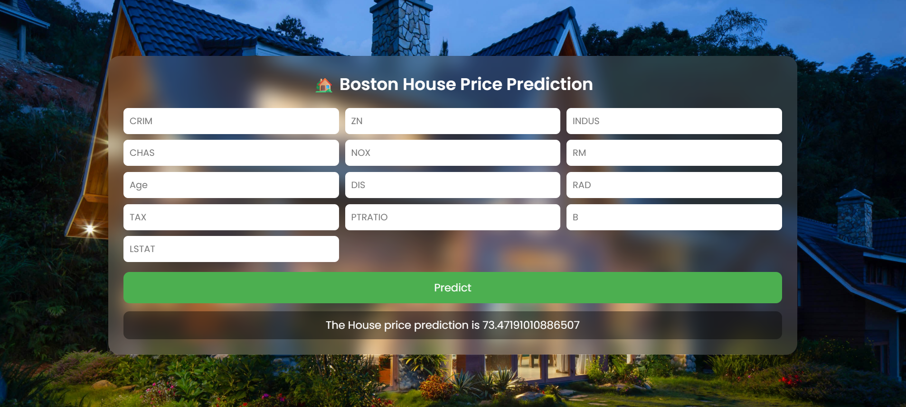

# 🏡 Boston House Pricing Prediction


---

## 🚀 Live Demo

👉 **Try the app here:**  
🔗 https://boston-house-pricing-4zdk.onrender.com

---

## 📌 Project Overview

This project is an **end-to-end Machine Learning web application** that predicts Boston house prices based on user-provided features.

It is built using **Flask** and deployed on the cloud, enabling **real-time predictions through a public web interface**.

---

## 🎯 Features

- 📊 Predict house prices using trained ML model  
- 🌐 Fully deployed web application  
- ⚡ Real-time prediction  
- 🧾 Clean and interactive UI  
- 🔌 Backend API integration  

---

## 🖼️ Demo Preview


```markdown
